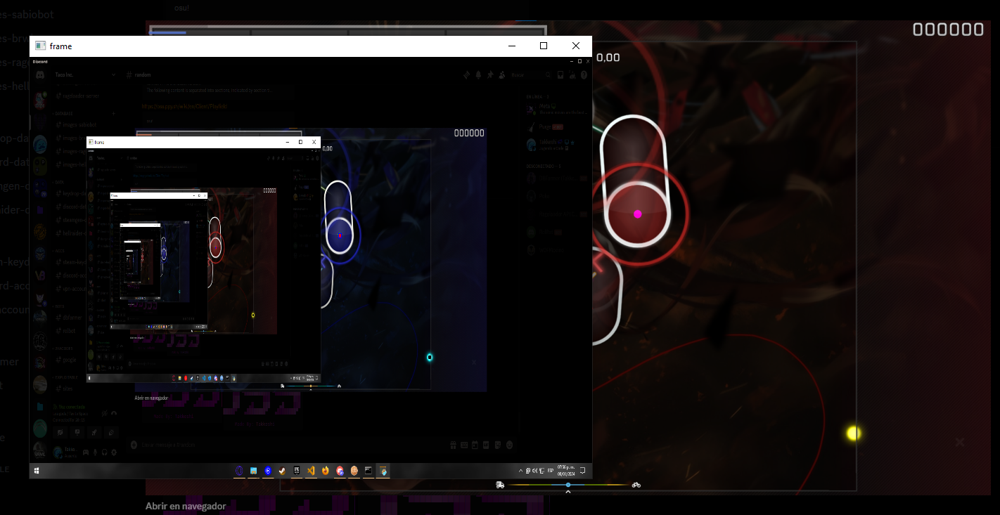
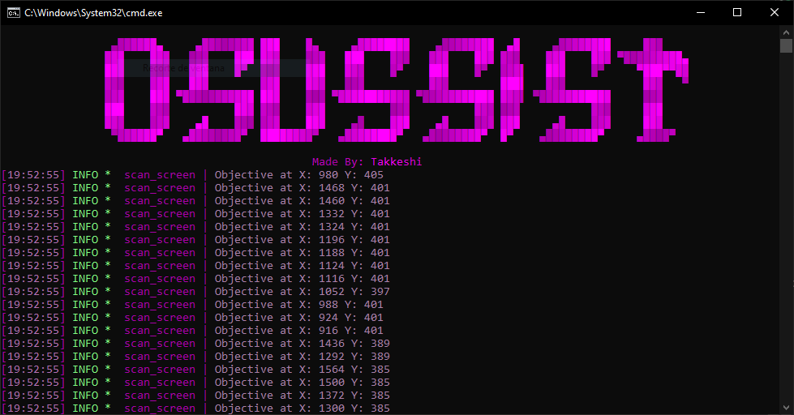

----

  

----
### 
🤖 Osussist 🤖

 

  Before you read anything else, If you are looking for the <strong>FULL IN DEPTH</strong> explanation on how it works check out my <a href="https://youtube.com/@takkeshi_dev">channel</a> in which Ill try to upload the in depth explanation of most of my scripts!
    
  Osussist is a tool that provides real-time aim assistance for the rhythm game osu. It is fully undetectable by the osu anti-cheat and open source, so you can see how it works and even make it better if you want.

----

### 
🧬 Installation 🧬

 

  <strong>Python Script:</strong>
    
  - For the python script you just need to start it and the libraries should auto download.
  - Once they auto download you should be good to go!
  
  <strong>Osu:</strong>
  
  - For osu you will need an skin which should be included inside the skin folder.
  - Once you have the skin you need to drag it into the osu window and it should install and equip it!
  
  <strong>Extras:</strong>
  
  - Make sure game is not in fullscreen!
  - You can change the programs color by changing *"menu_color"* in the config
  - You can change the skin, just make sure to update color values inside the config!

----
### 
⛑ How it works ⛑

 

  To use Osussist, you need to run the following command in the project directory:
  
    python osu.py
  
  Doing so will activate the aim assist and help you hit the circles. You can adjust the settings in the config file to customize the aim assist to your preference.

  

  

-----
### 
📦 Contribute 📦

 

  Osussist is an open source project and welcomes contributions from anyone who is interested. If you want to help improve the tool, you can fork this repository and make a pull request with your changes. You can also report any issues or suggestions on the issues tab.

----

### 
📌 Disclaimer 📌

 

    Please use this program only for educational purposes.
      
    It is not meant to be used in any malicious way, and I decline any responsibility for what you do with it.
      

-----
